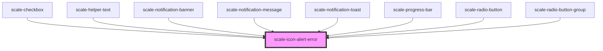

# scale-icon-alert-error

<!-- Auto Generated Below -->

## Properties

| Property             | Attribute             | Description                                                                     | Type      | Default          |
| -------------------- | --------------------- | ------------------------------------------------------------------------------- | --------- | ---------------- |
| `accessibilityTitle` | `accessibility-title` | (optional) When using the icon standalone, make it meaningful for accessibility | `string`  | `undefined`      |
| `color`              | `color`               | (optional) Alias for `fill`                                                     | `string`  | `'currentColor'` |
| `decorative`         | `decorative`          | (optional) If `true` the SVG element will get `aria-hidden="true"`              | `boolean` | `false`          |
| `fill`               | `fill`                | (optional) Sets the icon color via the `fill` attribute                         | `string`  | `'currentColor'` |
| `focusable`          | `focusable`           | (optional) If `true` the icon can receive focus                                 | `boolean` | `false`          |
| `selected`           | `selected`            | (optional) If `true`, the icon changes visually                                 | `boolean` | `false`          |
| `size`               | `size`                | (optional) The width and height in pixels                                       | `number`  | `24`             |

## Dependencies

### Used by

 - [scale-checkbox](../../checkbox)
 - [scale-helper-text](../../helper-text)
 - [scale-notification-banner](../../notification-banner)
 - [scale-notification-message](../../notification-message)
 - [scale-notification-toast](../../notification-toast)
 - [scale-progress-bar](../../progress-bar)
 - [scale-radio-button](../../radio-button)
 - [scale-radio-button-group](../../radio-button-group)

### Graph

----------------------------------------------

*Built with [StencilJS](https://stenciljs.com/)*
